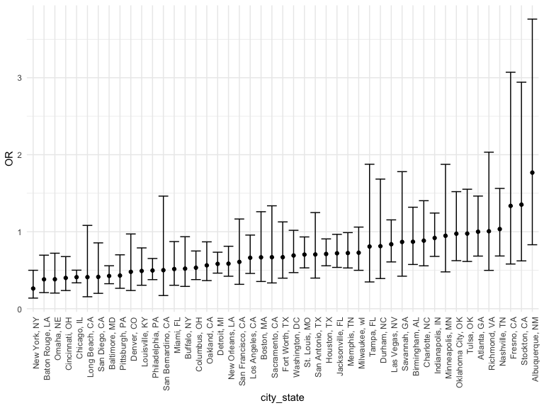
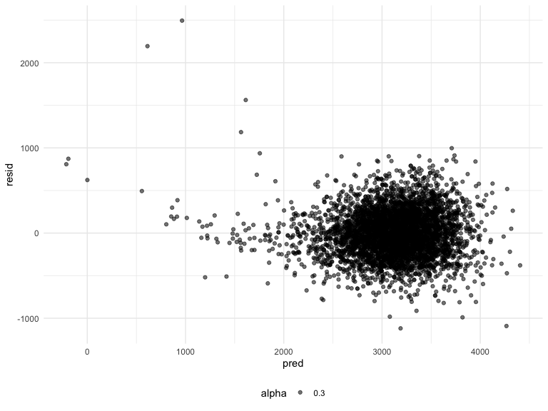

Homework 6 solutions
================
Zaynub Ibrahim
2020-12-09

### Problem 1

``` r
homicide_df = 
  read_csv("data/homicide-data.csv", na = c("", "NA", "Unknown")) %>% 
  mutate(
    city_state = str_c(city, state, sep = ", "),
    victim_age = as.numeric(victim_age),
    resolution = case_when(
      disposition == "Closed without arrest" ~ 0,
      disposition == "Open/No arrest"        ~ 0,
      disposition == "Closed by arrest"      ~ 1)
  ) %>% 
  filter(
    victim_race %in% c("White", "Black"),
    city_state != "Tulsa, AL") %>% 
  select(city_state, resolution, victim_age, victim_race, victim_sex)
```

    ## Parsed with column specification:
    ## cols(
    ##   uid = col_character(),
    ##   reported_date = col_double(),
    ##   victim_last = col_character(),
    ##   victim_first = col_character(),
    ##   victim_race = col_character(),
    ##   victim_age = col_double(),
    ##   victim_sex = col_character(),
    ##   city = col_character(),
    ##   state = col_character(),
    ##   lat = col_double(),
    ##   lon = col_double(),
    ##   disposition = col_character()
    ## )

Start with one city.

``` r
baltimore_df =
  homicide_df %>% 
  filter(city_state == "Baltimore, MD")

glm(resolution ~ victim_age + victim_race + victim_sex, 
    data = baltimore_df,
    family = binomial()) %>% 
  broom::tidy() %>% 
  mutate(
    OR = exp(estimate),
    CI_lower = exp(estimate - 1.96 * std.error),
    CI_upper = exp(estimate + 1.96 * std.error)
  ) %>% 
  select(term, OR, starts_with("CI")) %>% 
  knitr::kable(digits = 3)
```

| term              |    OR | CI\_lower | CI\_upper |
| :---------------- | ----: | --------: | --------: |
| (Intercept)       | 1.363 |     0.975 |     1.907 |
| victim\_age       | 0.993 |     0.987 |     1.000 |
| victim\_raceWhite | 2.320 |     1.648 |     3.268 |
| victim\_sexMale   | 0.426 |     0.325 |     0.558 |

Try this across cities.

``` r
models_results_df = 
  homicide_df %>% 
  nest(data = -city_state) %>% 
  mutate(
    models = 
      map(.x = data, ~glm(resolution ~ victim_age + victim_race + victim_sex, data = .x, family = binomial())),
    results = map(models, broom::tidy)
  ) %>% 
  select(city_state, results) %>% 
  unnest(results) %>% 
  mutate(
    OR = exp(estimate),
    CI_lower = exp(estimate - 1.96 * std.error),
    CI_upper = exp(estimate + 1.96 * std.error)
  ) %>% 
  select(city_state, term, OR, starts_with("CI")) 
```

``` r
models_results_df %>% 
  filter(term == "victim_sexMale") %>% 
  mutate(city_state = fct_reorder(city_state, OR)) %>% 
  ggplot(aes(x = city_state, y = OR)) + 
  geom_point() + 
  geom_errorbar(aes(ymin = CI_lower, ymax = CI_upper)) + 
  theme(axis.text.x = element_text(angle = 90, hjust = 1))
```



## Problem 2

First we import and clean data.

``` r
baby_df = 
  read_csv("./data/birthweight.csv") %>% 
  janitor::clean_names() %>% 
  mutate(
    babysex = as.factor(babysex), 
    frace = as.factor(frace), 
    malform = as.factor(malform),
    mrace = as.factor(mrace),
    smoken = as.factor(smoken), 
    frace = recode(frace,"1" = "white", "2" = "black", "3" = "asian", "4" = "puerto rican", "8" = "other" ),  fincome = fincome * 100)
```

    ## Parsed with column specification:
    ## cols(
    ##   .default = col_double()
    ## )

    ## See spec(...) for full column specifications.

For cleaning the data, I changed variables to factors and re-coded the
race variable to reflect the name of the actual race. I also multiplied
the income variable by 100 to reflect the actual value of income for
simplicities sake. There are 0 missing values in the entire dataframe.

Now I will fit a full saturated model of the data.

``` r
full_model = lm(bwt~., data = baby_df)
summary(full_model)
```

    ## 
    ## Call:
    ## lm(formula = bwt ~ ., data = baby_df)
    ## 
    ## Residuals:
    ##      Min       1Q   Median       3Q      Max 
    ## -1101.57  -181.56    -3.44   169.71  2337.53 
    ## 
    ## Coefficients: (3 not defined because of singularities)
    ##                     Estimate Std. Error t value Pr(>|t|)    
    ## (Intercept)       -6.363e+03  6.613e+02  -9.622  < 2e-16 ***
    ## babysex2           2.870e+01  8.491e+00   3.380 0.000732 ***
    ## bhead              1.309e+02  3.461e+00  37.812  < 2e-16 ***
    ## blength            7.485e+01  2.027e+00  36.923  < 2e-16 ***
    ## delwt              4.106e+00  3.957e-01  10.377  < 2e-16 ***
    ## fincome            2.954e-03  1.802e-03   1.639 0.101189    
    ## fraceblack         1.400e+01  4.630e+01   0.302 0.762411    
    ## fraceasian         1.825e+01  6.928e+01   0.263 0.792246    
    ## fracepuerto rican -4.514e+01  4.473e+01  -1.009 0.313001    
    ## fraceother         8.305e+00  7.431e+01   0.112 0.911016    
    ## gaweeks            1.153e+01  1.470e+00   7.844 5.49e-15 ***
    ## malform1          -7.930e+00  7.184e+01  -0.110 0.912103    
    ## menarche          -3.210e+00  2.906e+00  -1.105 0.269351    
    ## mheight            1.142e+01  1.033e+01   1.106 0.268923    
    ## momage             5.242e-01  1.229e+00   0.427 0.669741    
    ## mrace2            -1.523e+02  4.617e+01  -3.300 0.000975 ***
    ## mrace3            -8.956e+01  7.191e+01  -1.246 0.213001    
    ## mrace4            -5.915e+01  4.518e+01  -1.309 0.190547    
    ## parity             9.353e+01  4.053e+01   2.308 0.021069 *  
    ## pnumlbw                   NA         NA      NA       NA    
    ## pnumsga                   NA         NA      NA       NA    
    ## ppbmi              6.802e+00  1.491e+01   0.456 0.648252    
    ## ppwt              -3.890e+00  2.616e+00  -1.487 0.137019    
    ## smoken0.125        2.762e+00  4.399e+01   0.063 0.949934    
    ## smoken0.75        -9.373e+01  4.456e+01  -2.103 0.035490 *  
    ## smoken1            1.890e+01  2.363e+01   0.800 0.423962    
    ## smoken2           -6.060e+00  2.366e+01  -0.256 0.797868    
    ## smoken3            4.221e-02  2.349e+01   0.002 0.998566    
    ## smoken4           -1.004e+02  2.657e+01  -3.779 0.000160 ***
    ## smoken5           -3.796e+01  2.475e+01  -1.534 0.125126    
    ## smoken6           -2.154e+01  3.540e+01  -0.608 0.542918    
    ## smoken7           -2.821e+01  3.869e+01  -0.729 0.465865    
    ## smoken8           -1.191e+02  3.942e+01  -3.020 0.002538 ** 
    ## smoken9           -8.357e+01  6.124e+01  -1.365 0.172474    
    ## smoken10          -5.980e+01  1.698e+01  -3.522 0.000432 ***
    ## smoken11          -5.217e+01  9.651e+01  -0.541 0.588843    
    ## smoken12          -8.177e+01  7.329e+01  -1.116 0.264644    
    ## smoken13          -1.060e+02  6.465e+01  -1.639 0.101293    
    ## smoken14          -8.031e+01  1.928e+02  -0.416 0.677081    
    ## smoken15          -3.650e+01  2.807e+01  -1.300 0.193662    
    ## smoken16          -1.642e+02  1.363e+02  -1.205 0.228419    
    ## smoken17          -9.284e+01  9.122e+01  -1.018 0.308841    
    ## smoken18          -1.727e+02  6.640e+01  -2.601 0.009330 ** 
    ## smoken19          -1.049e+02  1.364e+02  -0.769 0.441692    
    ## smoken20          -1.193e+02  1.709e+01  -6.985 3.30e-12 ***
    ## smoken22          -1.578e+02  1.928e+02  -0.819 0.413107    
    ## smoken23          -2.823e+02  1.363e+02  -2.071 0.038423 *  
    ## smoken24           2.260e+02  1.963e+02   1.151 0.249659    
    ## smoken25           3.973e+01  7.598e+01   0.523 0.601065    
    ## smoken30          -1.572e+02  4.003e+01  -3.927 8.74e-05 ***
    ## smoken33           1.284e+02  2.725e+02   0.471 0.637550    
    ## smoken35          -5.189e+01  2.726e+02  -0.190 0.849022    
    ## smoken40          -1.189e+02  5.204e+01  -2.285 0.022372 *  
    ## smoken50           2.775e+01  2.727e+02   0.102 0.918970    
    ## smoken60          -1.054e+02  2.728e+02  -0.386 0.699337    
    ## wtgain                    NA         NA      NA       NA    
    ## ---
    ## Signif. codes:  0 '***' 0.001 '**' 0.01 '*' 0.05 '.' 0.1 ' ' 1
    ## 
    ## Residual standard error: 272.2 on 4289 degrees of freedom
    ## Multiple R-squared:  0.721,  Adjusted R-squared:  0.7176 
    ## F-statistic: 213.1 on 52 and 4289 DF,  p-value: < 2.2e-16

Next I will fit a hypothesized model for significant underlying factors
of birthweight.

``` r
hyp_model = lm(bwt ~ babysex + bhead + blength + fincome + gaweeks + mrace + malform + ppbmi, data = baby_df)

hyp_model %>% 
  broom::glance()
```

    ## # A tibble: 1 x 12
    ##   r.squared adj.r.squared sigma statistic p.value    df  logLik    AIC    BIC
    ##       <dbl>         <dbl> <dbl>     <dbl>   <dbl> <dbl>   <dbl>  <dbl>  <dbl>
    ## 1     0.703         0.703  279.     1027.       0    10 -30610. 61243. 61320.
    ## # … with 3 more variables: deviance <dbl>, df.residual <int>, nobs <int>

``` r
hyp_model %>% 
  broom::tidy() %>% 
  select(term, estimate, p.value) %>% 
  knitr::kable(digits = 3)
```

| term        |   estimate | p.value |
| :---------- | ---------: | ------: |
| (Intercept) | \-5983.521 |   0.000 |
| babysex2    |     34.340 |   0.000 |
| bhead       |    136.370 |   0.000 |
| blength     |     79.696 |   0.000 |
| fincome     |      0.004 |   0.025 |
| gaweeks     |     11.742 |   0.000 |
| mrace2      |  \-115.162 |   0.000 |
| mrace3      |   \-76.558 |   0.077 |
| mrace4      |  \-118.087 |   0.000 |
| malform1    |     15.974 |   0.825 |
| ppbmi       |      4.855 |   0.000 |

Next I will add residuals.

``` r
plot_df = baby_df %>% 
  add_residuals(hyp_model) %>%
  add_predictions(hyp_model) %>%
  ggplot(aes(x = pred, y = resid)) +
  geom_point(aes(alpha = 0.30))

print(plot_df)
```



Next I will compare this model to two others. The first is using length
at birth and gestational age as predictors (main effects only).

``` r
model_one = lm(bwt ~ blength + gaweeks, data = baby_df)
summary(model_one)
```

    ## 
    ## Call:
    ## lm(formula = bwt ~ blength + gaweeks, data = baby_df)
    ## 
    ## Residuals:
    ##     Min      1Q  Median      3Q     Max 
    ## -1709.6  -215.4   -11.4   208.2  4188.8 
    ## 
    ## Coefficients:
    ##              Estimate Std. Error t value Pr(>|t|)    
    ## (Intercept) -4347.667     97.958  -44.38   <2e-16 ***
    ## blength       128.556      1.990   64.60   <2e-16 ***
    ## gaweeks        27.047      1.718   15.74   <2e-16 ***
    ## ---
    ## Signif. codes:  0 '***' 0.001 '**' 0.01 '*' 0.05 '.' 0.1 ' ' 1
    ## 
    ## Residual standard error: 333.2 on 4339 degrees of freedom
    ## Multiple R-squared:  0.5769, Adjusted R-squared:  0.5767 
    ## F-statistic:  2958 on 2 and 4339 DF,  p-value: < 2.2e-16

The second is using head circumference, length, sex, and all
interactions (including the three-way interaction) between these.

``` r
model_two = lm(bwt ~ bhead + babysex + blength + bhead*blength + bhead*babysex + babysex*blength + babysex*blength*bhead, data = baby_df)
summary(model_two)
```

    ## 
    ## Call:
    ## lm(formula = bwt ~ bhead + babysex + blength + bhead * blength + 
    ##     bhead * babysex + babysex * blength + babysex * blength * 
    ##     bhead, data = baby_df)
    ## 
    ## Residuals:
    ##      Min       1Q   Median       3Q      Max 
    ## -1132.99  -190.42   -10.33   178.63  2617.96 
    ## 
    ## Coefficients:
    ##                          Estimate Std. Error t value Pr(>|t|)    
    ## (Intercept)            -7176.8170  1264.8397  -5.674 1.49e-08 ***
    ## bhead                    181.7956    38.0542   4.777 1.84e-06 ***
    ## babysex2                6374.8684  1677.7669   3.800 0.000147 ***
    ## blength                  102.1269    26.2118   3.896 9.92e-05 ***
    ## bhead:blength             -0.5536     0.7802  -0.710 0.478012    
    ## bhead:babysex2          -198.3932    51.0917  -3.883 0.000105 ***
    ## babysex2:blength        -123.7729    35.1185  -3.524 0.000429 ***
    ## bhead:babysex2:blength     3.8781     1.0566   3.670 0.000245 ***
    ## ---
    ## Signif. codes:  0 '***' 0.001 '**' 0.01 '*' 0.05 '.' 0.1 ' ' 1
    ## 
    ## Residual standard error: 287.7 on 4334 degrees of freedom
    ## Multiple R-squared:  0.6849, Adjusted R-squared:  0.6844 
    ## F-statistic:  1346 on 7 and 4334 DF,  p-value: < 2.2e-16

Next I will use cross validation to to make a comparison of all the
models.

``` r
crossval_df = crossv_mc(baby_df, 100)

crossval_df = 
  crossval_df %>% 
  mutate(train = map(train, as_tibble, 
         test = map(as_tibble)))

crossval_df =
  crossval_df %>% 
  mutate(fit1 = map(train, ~lm(bwt ~ babysex + bhead + blength + fincome + gaweeks + mrace + malform + ppbmi, data = .x)), 
         fit2 = map(train, ~lm(bwt ~ blength + gaweeks, data = .x)), 
         fit3 = map(train, ~lm(bwt ~ bhead + babysex + blength + bhead*blength + bhead*babysex + babysex*blength + babysex*blength*bhead, .x))) %>%
  mutate(fit = map2_dbl(fit1, test, ~rmse(model = .x, data = .y)), 
         fit1 = map2_dbl(fit2, test, ~rmse(model = .x, data = .y)), 
         fit2 = map2_dbl(fit3, test, ~rmse(model = .x, data = .y)))

modelnames = c("Hypothesized Model", "Comparison Model 1", "Comparison Model 2")
```

Next I will plot the prediction error distribution.
